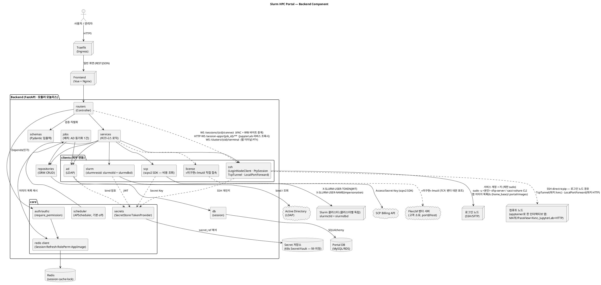

# Architecture — Slurm HPC Portal (Backend)

백엔드의 **컴포넌트 구조**와 **클래스 구조**를 다이어그램으로 정리한다.
설계 근거는 [backend-design.md](backend-design.md), 데이터 모델은 [db-erd.md](db-erd.md), 기능 SoT는 [정의서.md](../정의서.md)(특히 §4.1 연동 경로 매핑).

> **상태(2026-08-11): `backend/app/` 실코드와 대조해 갱신함.** 컴포넌트 경계·외부 연동
> 경로·client 메서드명은 코드와 일치한다. 어긋나면 코드가 이긴다.
>
> **미구현 컴포넌트**: `LicenseClient`/`LicenseService`(A-LM 전부, SCR-17) — 아래 다이어그램에
> `«미구현»`으로 표시했다. 티켓(A-OP-05)·정기 리포트(A-RP-04)·과금 연계(A-RP-05)·비용
> 수집 이력(A-BL-03·04)도 표만 있고 코드가 없다([db-erd.md](db-erd.md) §3).
>
> [class_diagram.puml](class_diagram.puml)(§3의 그림)도 같은 날 **전면 재작성**했다.
> 이전 판에는 지운 표(`JobTemplate`)와 만들지 않은 컴포넌트(`GatewayService`·
> `InternalRouter`), 쪼개지 않은 서비스 6개(`NodeService`·`PartitionService`·
> `ReservationService`·`QosService`·`SlurmUserService`·`UsageService`)가 남아 있었다.

---

## 1. 컴포넌트 다이어그램

계층(router→service→repository/client)과 외부 시스템 경계. (backend-design §1.2·§2·§4·§7)

> **인터랙티브 세션 트래픽 경로(중요, 백엔드가 중계한다)**: 앱에 따라 **두 갈래**이며
> 어느 쪽인지는 코드 카탈로그의 `transport`가 정한다(`services/session_apps.py`).
>
> | transport | 앱 | 브라우저가 붙는 곳 | 백엔드가 여는 것 |
> |---|---|---|---|
> | `vnc` | 원격 데스크톱 · ParaView | `WS /sessions/{sid}/connect` | `TcpTunnel` = SSH `direct-tcpip` → 워커 Xvnc(5901~), **RFB 바이트를 그대로 중계** |
> | `http` | JupyterLab | `HTTP·WS /session-apps/{job_id}/**` | `LocalPortForward`(세션당 1개, 재사용·유휴 300초 회수) → 워커 HTTP, **리버스 프록시** |
>
> 공통 규칙은 같다. 접속 정보의 유일한 출처는 세션 Job이 워커에 남기는 `connection.json`이며
> (홈=공유 NFS), 세션이 살아 있는지는 **Slurm Job 상태**가 권위 있는 출처다.
> `interactive_session` 표는 "누가 어떤 클러스터에 무엇을 띄웠나"만 기록한다.
> **워커의 host/port는 브라우저에 내보내지 않는다.**
>
> HTTP 경로가 경로에 싣는 것은 포털 세션 id가 아니라 **Slurm Job ID**다 — 컨테이너가 자기
> `base_url`을 정할 때 아는 것이 그것뿐이기 때문이다(포털 세션 id는 Job 제출 *뒤에* 생긴다).
> 소유자 조건을 조회에 붙여 찾으므로 남의 Job ID를 넣어도 세션이 나오지 않고, 인증은
> 캐시와 무관하게 매 요청 확인한다(해석 결과만 60초 캐시 — 없으면 페이지 한 장에
> DB 조회 + SSH + SFTP가 수십 번 붙어 커넥션 풀이 마른다, 실측).
>
> **초기 설계(Traefik HTTP provider 폴링 → 컴퓨트 노드 직결)는 채택하지 않았다.**
> Open OnDemand는 정적 프록시 규칙 하나(`ProxyPassMatch ^/node/([^/]+)/(\d+)`)로 경로에서
> 노드·포트를 뽑지만 **Traefik에는 그에 상응하는 수단이 없다**(docs/plan.md §3.3).
> 백엔드가 중계하는 방식은 부수적으로 두 가지를 얻는다 — 워커 host/port가 브라우저에
> 노출되지 않아 열린 프록시가 되지 않고, 소유자 확인을 서버가 매 연결마다 강제한다.
> 그래서 `/internal/gateway/dynamic-config`·`/internal/sessions/{id}/ready`는 **구현되지
> 않았고**, `interactive_session.node_host/node_port/connect_url`도 쓰지 않는다.
>
> **앱 이미지 조회 경로(SSH를 한 번 더 쓴다)**: "이 클러스터에 그 이미지가 실제로 있나"는
> **클러스터에 직접 묻는다**(`services/app_images.py` → `LoginNodeClient.list_dir`).
> 백엔드 파드의 파일시스템을 읽지 않는다 — 그게 맞아떨어졌던 것은 dev01이 클러스터와 같은
> NFS를 마운트하고 있어서고, **파드 마운트는 Deployment에 정적으로 박혀 있어 클러스터를
> 등록해도 생기지 않는다.** 디렉터리는 `{cluster.home_base}/.portal/images`로 파생하며
> (`home_base`가 비면 `settings.app_image_dir` 폴백) 결과는 `appImages:{cluster_id}`로
> 60초 캐시한다. **실패는 캐시하지 않는다** — 캐시 키가 클러스터라, 로그인 노드에
> 프로비저닝되지 않은 사용자 하나가 60초 동안 모두의 앱을 잠글 수 있다.
>
> **License 수집 경로(설계 — 아직 코드가 없다)**: `license` client는 SSH를 거치지 않고 **백엔드 컨테이너에 내장된 lmutil**로 고객의 FlexLM 벤더 서버(`port@host`)에 직접 TCP 접속하는 것으로 계획했다 — 클러스터 스코프와 무관한 독립 client. 단, A-LM-03(Slurm Licenses 동기화, `sacctmgr add resource`)은 반영 대상 클러스터의 `slurm` client(REST/CLI 폴백)를 통해 이뤄지므로 A-LM-02(수집)와 실행 경로가 다르다. **현재 `app/clients/`에 `license`는 없다.**

---

## 2. Slurm 호출 면 (slurmrestd) 매핑

`slurm` client(`SlurmrestdClient`) 하나가 **두 API 그룹**을 감싼다. 경로 접두(`/slurm` vs `/slurmdb`)로만 갈리고 JWT가 같아서다. 계정/QOS/association/사용량(= `sacct`/`sacctmgr` 상당)이 slurmdbd 그룹이다. (정의서 §4.1 ①)

> **버전은 `v0.0.43` 하나로 고정한다.** `SUPPORTED_API_VERSIONS`가 이 값만 받는다
> (`app/schemas/cluster.py`). 이유는 **예약 생성**이다 — `POST /reservation`은 0.0.43에만
> 있고 0.0.40~0.0.42는 조회·삭제만 연다(실측). 0.0.43을 서비스하지 않는 구버전 Slurm은
> 등록할 수 없다.
>
> **서비스는 기능별로 잘게 쪼개지 않았다.** `ClusterService` 하나가 노드·파티션·예약·
> 계정·QOS·대시보드 지표를 담당한다 — 전부 "선택된 클러스터에 REST로 묻는다"는 같은
> 모양이라 클래스를 나눌 이유가 없었다.

### 2.1 slurmctld 그룹 — 제어 (`/slurm/v0.0.43/...`)
| 기능 ID | 경로(대표) | Client 메서드 | Service (메서드) |
|---|---|---|---|
| U-JB-04·05, A-JB-01 | `GET /jobs`, `GET /job/{id}` | `get_jobs` / `get_job` | `JobService.list_jobs` / `.get_job` |
| U-JB-01·02·08 | `POST /job/submit` | `submit_job(spec, as_user)` | `JobService.submit` / `.resubmit` |
| U-JB-07, A-JB-02 | `DELETE /job/{id}` | `cancel_job(id, as_user)` | `JobService.cancel` |
| A-JB-02·03 | `POST /job/{id}` (hold/release/priority) | `update_job(id, patch, as_user)` | `JobService.control` |
| A-ND-01 | `POST /node/{name}` (DRAIN/RESUME/DOWN) | `update_node(name, patch)` | `ClusterService.set_node_state` |
| A-ND-02, U-CL-01·02, A-DB-01 | `GET /nodes`, `GET /node/{name}` | `get_nodes` / `get_node` | `ClusterService.nodes` / `.metrics` |
| A-ND-03, U-JB-01 | `GET /partitions` (**조회만**) | `get_partitions` | `ClusterService.partitions` · `JobService.options` |
| A-ND-04 | `GET/POST/DELETE /reservation[s]` | `get_reservations` / `create_reservation` / `delete_reservation` | `ClusterService.reservations` 외 |
| A-DB-01·03·04 | `GET /ping`, `GET /diag` | `ping` / `diag` | `ClusterService.test_rest` / `.metrics` / `.events` |

> **파티션 수정(`update_partition`)은 없다.** slurm.conf 영속화가 필요해 REST만으로 끝나지
> 않으므로 조회만 연다 — 화면도 조회 전용이다.

### 2.2 slurmdbd 그룹 — 회계·관리 (`/slurmdb/v0.0.43/...`, = sacct·sacctmgr·sreport)
| 기능 ID | 경로(대표) | Client 메서드 | Service (메서드) |
|---|---|---|---|
| A-US-02 | `GET/POST/DELETE /account[s]` | `get_accounts` / `create_account` / `delete_account` | `ClusterService.accounts` 외 |
| A-US-02·04 | `GET/POST/DELETE /association[s]` (사용자↔계정 N:M) | `get_associations` / `add_user_association` / `set_association_qos` / `delete_association` | `ClusterService.add_account_user` / `.set_association_qos` / `.remove_account_user` · `app_access.user_accounts` |
| A-US-03, U-JB-01 | `GET/POST/DELETE /qos` (한도·우선순위) | `get_qos` / `create_qos` / `delete_qos` | `ClusterService.qos` 외 · `JobService.options` |
| — | `GET /user/{name}` | `get_slurm_user` | **호출하는 곳이 없다** — `/user/{name}`은 응답에 associations를 채워주지 않아(항상 빈 배열, 실측) 소속을 알 수 없다. 소속은 `/associations`로 푼다. |
| U-JB-09, A-JB-04, U-AC-01, A-RP-01·02·03 | `GET /jobs` (회계 이력 = sacct) | `get_accounting_jobs(filter)` | `JobService.history` · `ReportService.usage`(A-RP-01)/`.utilization`(02)/`.wait_time`(03) · `AccountService.usage`(U-AC-01) |

> **REST 미지원 op는 CLI로 폴백한다**(정의서 §4.1). 지금 실제로 폴백하는 것은
> **Fairshare**다 — v0.0.41~43의 association에는 *계산된* fairshare가 없어서
> (`shares_raw`/`usage_raw`만 준다) `LoginNodeClient.fairshare()`가 로그인 노드에서
> `sshare`를 돌린다(U-AC-01·02, `AccountService.fairshare`). 같은 방식으로
> `filesystems()`·`quota()`도 CLI다. **`create/delete_user`·`update_qos`·`get_config`는
> 구현하지 않았다** — 필요해지면 여기가 자리다. **A-US-05(파티션별 허용 계정)도 미구현**이며,
> `slurm.conf`의 `AllowAccounts`라 REST로는 끝나지 않는다(정의서에서도 '권장').

### 2.3 보조 경로 (참고, §1 컴포넌트)
| 경로 | 기능 ID | Client | Service |
|---|---|---|---|
| SSH/SFTP (`sudo -u <본인> sftp-server`) | U-FM-01~04, U-JB-06(로그 tail) | `LoginNodeClient` | `FileService` |
| SSH PTY | U-SH-01 | `PtySession` | `TerminalService` |
| SSH `direct-tcpip` (RFB 중계) | U-IA-02·04 | `TcpTunnel` | `SessionService` |
| SSH 로컬 포트포워딩 (HTTP 프록시) | U-IA-01(JupyterLab) | `LocalPortForward` | `SessionProxyService` |
| SSH `ls` (앱 이미지 존재 확인) | A-OP-02, U-IA-01·02, U-JB-13 | `LoginNodeClient.list_dir` | `AppImageService` |
| SSH CLI 폴백 (`sshare`·`df`·`quota`) | U-AC-01·02 | `LoginNodeClient` | `AccountService` |
| LDAP | A-US-01, C-01 | `AdClient` | `AuthService` / `AdService`(sync) |
| SCP 비용 조회 (scpv2 SDK) | A-BL-01·03 | `ScpBillingClient` | `BillingService` |
| FlexLM(lmutil, TCP 직접) | A-LM-01·02·05 | `LicenseClient` **«미구현»** | `LicenseService` **«미구현»** |

> **License 실행 경로 이원화(설계)**: A-LM-01·02·05(라이선스 서버 등록·lmstat 수집·사용 모니터링)는 클러스터 무관 — `LicenseClient`가 백엔드에서 FlexLM 벤더 서버로 직접 TCP 접속. **A-LM-03(Slurm Licenses 동기화)만 예외** — 가용 수량을 반영할 **대상 클러스터**의 `SlurmrestdClient`(REST 미지원 시 CLI 폴백)를 통해 `sacctmgr add resource`를 수행하므로 클러스터 스코프. **둘 다 아직 코드가 없다.**

---

## 3. 클래스 다이어그램

계층 관계: **Service ↔ Repository/Client = 조합(has-a, `o-->`)**, **BaseHttpClient ↔ SlurmrestdClient = 상속(is-a, `<|--`)**. `AdClient`(LDAP)·`LoginNodeClient`(SSH)·`ScpBillingClient`(SDK 래퍼)는 프로토콜·구현이 달라 베이스 없이 단독이다.
slurm client는 **클러스터 단위로 구성**되므로(§2.2) `ClusterClientFactory`가 등록 정보(`cluster`)와 자격증명(`cluster_credential.secret_ref` → Secret 저장소)으로 클러스터별 인스턴스를 만들어 재사용한다.

> **다이어그램 소스**: [class_diagram.puml](class_diagram.puml) — 클래스 다이어그램은 규모가 커서 별도 .puml 파일로 분리했다. 렌더링: `plantuml docs/class_diagram.puml` 또는 VS Code PlantUML 확장(Alt+D).
>
> **모델 속성은 그 그림에 없다.** 컬럼·타입·인덱스·FK의 SoT는 [db-erd.md](db-erd.md)이고,
> 컬럼을 두 파일에 복사해 둔 것이 그 그림이 썩은 원인이었다(존재한 적 없는
> `BillingConfig.scp_project_id`·`Cluster.group_path_tpl`이 남아 있었다). 그림에는 모델
> **이름과 소유 관계**만 두고 내용은 db-erd.md 한 곳에서 본다.

**요점**
- **REST 공통은 `BaseHttpClient`에 집약**: `base_url`·타임아웃·재시도(멱등 op 한정, backoff)·TLS 검증·**keep-alive 세션 풀**(§2.1)·`request(method, path, params, json, headers)`·상태코드→도메인 예외 매핑(401=Unauthorized). **실제로 상속하는 것은 `SlurmrestdClient` 하나다.** `ScpBillingClient`는 설계 당시 예상과 달리 자체 REST 호출을 하지 않고 **`scpv2` SDK를 감싼다** — 서명·엔드포인트를 SDK가 처리하므로 공통 베이스가 낄 자리가 없다(대신 `costexplorer`가 리전 없는 전역 호스트라 SDK의 엔드포인트 조립 규칙을 그 서비스 하나만 교정한다, 실측). `AdClient`(LDAP)·`LoginNodeClient`(SSH)도 프로토콜이 달라 단독이다(투기적 추상화 배제).
- **JWT 자격증명 흐름**: Portal DB `cluster_credential.secret_ref` → `SecretStore`(K8s Secret/Vault, §9 미정)에서 실값 해석 → `SlurmTokenProvider`가 클러스터별 캐시 + `exp` 클레임 디코드(만료 사전 알림) + 401 시 재등록 안내(§2.2) → `SlurmrestdClient._headers()`가 매 호출 `X-SLURM-USER-TOKEN`(JWT) + `X-SLURM-USER-NAME`(**서버 사이드에서 인증된 본인만**, §2.3) 구성. SSH 개인키·AD bind 암호도 같은 `SecretStore` 경유(DB엔 참조만).
- **단일 `SlurmrestdClient`, 클러스터별 인스턴스**: slurmctld/slurmdbd는 경로 접두(`/slurm` vs `/slurmdb`)로만 갈리는 동일 엔드포인트·동일 JWT라 client는 하나로 통합하고, `ClusterClientFactory`가 클러스터당 1개 생성·풀링(keep-alive 재사용). **service 쪽 분리는 설계보다 굵게 끝났다** — 클러스터에 REST로 묻는 일(노드·파티션·예약·계정·QOS·지표)은 `ClusterService` 하나가 맡고, Job 계열만 `JobService`, 회계 집계만 `ReportService`/`AccountService`로 갈렸다.
- **세션·권한 캐시**: `require_permission` = 포털 세션 JWT 검증 + Redis `SessionStore`(키 = 난수 `sid`, 신원은 세션 레코드의 `user_guid`가 정본 — username 재사용 시 세션 혼선 방지, 기기별/전체 강제 로그아웃 즉시 반영) + `PermissionCache`(rolePerm TTL 캐시)(§4). 라우터는 `require_permission("qos:modify")`류 permission 문법 유지 → dict→DB 전환에도 무수정(§3.4). 로그인(AD bind→JIT→세션 등록)은 `AuthService`(§3.3·§3.6).
- **REST 미지원 폴백**: `LoginNodeClient`가 로그인 노드에서 CLI를 돌린다. 지금 실제로 쓰는 것은 `fairshare()`(`sshare`)·`filesystems()`(`df`)·`quota()`뿐이다 — §2.2 각주.
- **API 토큰(구현됨, `ApiTokenService`)**: 액세스 토큰(30분)으로는 자동화를 감당할 수 없고 AD 비밀번호를 스크립트에 박으면 **반복 실패로 계정이 잠긴다.** 그래서 사람 로그인과 분리된 장수명 자격증명을 둔다. **원문을 저장하지 않고**(sha256) 발급 직후 한 번만 보여 준다. 권한은 소유자의 역할을 그대로 따르며 토큰별 스코프는 아직 없다.
- **RBAC 초기 상태**: role = `USER`·`ADMIN` 2행, permission = `admin:access`(ADMIN 페이지 접근 여부) 1행, 매핑 = ADMIN→admin:access뿐. 테이블 구조(N:M)는 향후 role 추가(예: PI)·`resource:action` 세분화를 **행 추가만으로** 수용(§3.4) — 라우터가 처음부터 permission 문법이므로 세분화 시에도 무수정.
- **경계 유지**: account/qos/association은 slurmdbd 소유(Portal DB 아님). `models`는 db-erd.md의 **포털 소유 22개 엔티티와 1:1 동기**(속성 포함). 타입/길이·인덱스·관계(FK) 상세의 SoT는 db-erd.md이며, 그보다 정확한 것은 `backend/app/models/`다.
- **계층 방향은 문서가 아니라 테스트가 강제한다** — [test_layering.py](../backend/tests/test_layering.py)가 라우터→repository/client 직접 호출, service→router 역참조, client→DB 접근을 AST로 막는다. 문서로만 둔 규약은 도메인이 늘면서 조용히 무너진다.
- **인터랙티브 세션(구현됨, `SessionService`)**: 세션은 **Slurm 배치 Job**이다. 제출은
  slurmrestd, 컨테이너는 워커에서 apptainer로 뜨고, 접속 정보는 Job이 워커에 남기는
  `connection.json`(공유 홈)을 로그인 노드 경유 SFTP로 읽는다. 브라우저 noVNC ↔ 워커 Xvnc
  사이는 **백엔드가 `WS /sessions/{sid}/connect`에서 RFB 바이트를 중계**한다
  (`TcpTunnel` = SSH `direct-tcpip`). 두 출처를 섞지 않는다 — **살아 있는가는 Slurm Job
  상태**, **어디로 붙는가는 `connection.json`**. 노드가 죽으면 정리 훅이 돌지 않아 파일이
  남기 때문이다(실측).
  - **워커 자격증명이 필요 없다**: `direct-tcpip`의 목적지는 로그인 노드의 sshd가 해석한다
    (`ssh -L`과 같은 원리). 포털은 로그인 노드 자격증명만 갖는다.
  - **접속 위치는 브라우저에 내보내지 않는다**(열린 프록시 방지). 세션 ID만 받고 서버가
    소유자를 확인한 뒤 터널을 연다.
  - **HTTP 앱은 `SessionProxyService`가 따로 맡는다**(위 표). 세션 대장·`connection.json`
    규칙은 공유하고 붙는 방법만 다르다.
  - **U-IA-03(VS Code)는 포털이 호스팅하지 않는다** — code-server는 base path 지원을
    제거해 하위 경로로 서비스할 수 없고(에셋이 절대 경로로 새어 나간다), 세션별 서브도메인은
    와일드카드 DNS·인증서가 필요해 포털 밖 결정이다. 대신 **VS Code Remote-SSH**를
    안내한다(카탈로그에 `ready=False` + 안내문으로 남겨 둔다). U-IA-05(세션 공유)도 미구현.
- **앱은 세 개의 자물쇠를 통과해야 실행된다**(`AppAccessService` + `AppImageService`).
  잠그되 **숨기지 않고**, 각각 자기 이유를 말한다.
  1. `ready` — 실행 방식이 확정됐는가. **코드 카탈로그**가 답한다.
  2. `installed` — 이미지 파일이 **이 클러스터에** 있는가. 클러스터가 SSH로 답한다
     (그래서 A 클러스터에만 있는 SIF는 B에서 카드가 잠긴다).
  3. `allowed` — `app_access`에 배정된 계정에 소속돼 있는가. **행이 없으면 전원 허용**이다 —
     기본을 잠김으로 두면 표를 만든 순간 모든 앱이 멈춘다.
  목록에서 잠그는 것만으로는 제한이 되지 않으므로(화면을 거치지 않는 호출이 있다)
  **제출 직전에 `resolve_installed()`가 한 번 더 막는다** — 여기서 막지 않으면 Job이 워커까지
  가서 죽고 화면에는 "FAILED"만 남는다.
- **License(설계, 미구현)**: `LicenseService`가 `LicenseClient`(독립, REST도 SSH도 아님)로 고객 FlexLM 서버에 **직접 TCP 접속**(`lmutil`은 백엔드 컨테이너에 내장된 배포 단위 바이너리, 서버별 경로 설정 아님). A-LM-03만 예외로 대상 클러스터의 `SlurmrestdClient`를 사용(§2.3 각주).
- **부트스트랩 상태 확인**: `AuthService.is_bootstrapped()` — `ad_connection.seed_admin_guid` 존재 여부로 판정, `GET /auth/setup-status`(공개)로 노출. 판정 후 `bootstrap_required=false`면 `POST /auth/setup`은 서버측에서 하드 거부(1회용 잠금).
- **Job 제출 지원**: `JobService.validate()`는 **만들지 않았다.** 대신 `options()`가 파티션·소속 계정·QOS·GPU 파티션·**노드 실제 용량**을 한 번에 내려 폼이 고를 수 없는 값을 아예 보여주지 않는다(기본값이 노드보다 크면 첫 제출부터 실패한다 — 실측). 한 항목이 실패해도 나머지는 돌려주고, slurmrestd가 부분 실패를 500으로 주면서도 본문에 목록을 실어 보내면 그것까지 건져 쓴다(실측). **예상 대기시간**(`sbatch --test-only` 상당)과 **클러스터 간 비교 추천**은 여전히 범위 밖이다.

---

## 4. 렌더링 방법
- **컴포넌트 다이어그램**(§1, 본 문서 내 코드 블록): `plantuml docs/Architecture.md` 또는 VS Code **PlantUML** 확장(Alt+D) — Graphviz 또는 내장 서버 필요
- **클래스 다이어그램**(§3, 별도 파일): `plantuml docs/class_diagram.puml` 또는 [class_diagram.puml](class_diagram.puml)을 열고 Alt+D
- 온라인: PlantUML 서버(www.plantuml.com/plantuml)에 붙여넣기
