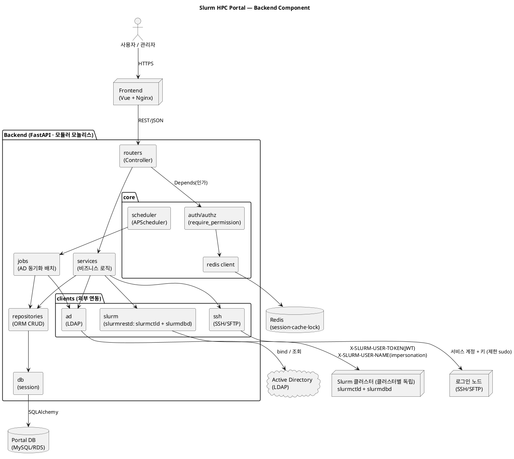

# Architecture — Slurm HPC Portal (Backend)

백엔드의 **컴포넌트 구조**와 **클래스 구조**를 다이어그램으로 정리한다.
설계 근거는 [backend-design.md](backend-design.md), 데이터 모델은 [db-erd.md](db-erd.md), 기능 SoT는 [정의서.md](../정의서.md)(특히 §4.1 연동 경로 매핑).

> 상태: 설계(구현 전). 클래스·메서드는 정의서 기능 ID와 slurmrestd v0.0.41 API 면에 근거한 **설계 초안**이며, 시그니처·전체 목록은 구현 시 확정한다.

---

## 1. 컴포넌트 다이어그램

계층(router→service→repository/client)과 외부 시스템 경계. (backend-design §1.2·§2·§4·§7)

---

## 2. Slurm 호출 면 (slurmrestd) 매핑

`slurm` client는 **두 API 그룹**을 감싼다. 계정/QOS/association/사용량(= `sacct`/`sacctmgr` 상당)은 slurmdbd 그룹이며, 단순 job submit/cancel은 전체의 일부다. (정의서 §4.1 ①)

### 2.1 slurmctld 그룹 — 제어 (`/slurm/v0.0.41/...`)
| 기능 ID | 경로(대표) | Client 메서드 | Service |
|---|---|---|---|
| U-JB-04·05, A-JB-01 | `GET /jobs`, `GET /job/{id}` | `get_jobs` / `get_job` | JobService |
| U-JB-01·02·03·08 | `POST /job/submit` | `submit_job(spec, as_user)` | JobService |
| U-JB-07, A-JB-02 | `DELETE /job/{id}` | `cancel_job(id, as_user)` | JobService |
| A-JB-02·03 | `POST /job/{id}` (hold/release/priority) | `update_job(id, patch)` | JobService |
| A-ND-01 | `POST /node/{name}` (DRAIN/RESUME/DOWN) | `update_node(name, state, reason)` | NodeService |
| A-ND-02, U-CL-01·02, A-DB-01 | `GET /nodes`, `GET /node/{name}` | `get_nodes` / `get_node` | NodeService |
| A-ND-03 | `GET/POST /partition/{name}` (slurm.conf 반영은 구성관리/CLI) | `get_partitions` / `update_partition` | PartitionService |
| A-ND-04 | `GET/POST/DELETE /reservation[s]` | `list/create/delete_reservation` | ReservationService |
| A-DB-01·03·04 | `GET /ping`, `GET /diag` | `ping` / `diag` | DashboardService |

### 2.2 slurmdbd 그룹 — 회계·관리 (`/slurmdb/v0.0.41/...`, = sacct·sacctmgr·sreport)
| 기능 ID | 경로(대표) | Client 메서드 | Service |
|---|---|---|---|
| A-US-02 | `GET/POST/DELETE /account[s]` | `get/create/delete_account` | AccountService |
| A-US-02·04 | `GET/POST/DELETE /association[s]` (사용자↔계정 N:M, Fairshare share) | `get/create/delete_association` | AccountService |
| A-US-03 | `GET/POST/DELETE /qos` (한도·우선순위·허용/기본 배정) | `get/create/update/delete_qos` | QosService |
| A-US-02·03 | `GET/POST/DELETE /user[s]` (Slurm 사용자·기본계정·기본 QOS) | `get/create/delete_user` | SlurmUserService |
| U-JB-09, A-JB-04, A-RP-03 | `GET /jobs` (회계 이력 = sacct) | `get_accounting_jobs(filter)` | UsageService |
| U-AC-01·02, A-RP-01·02 | association usage·TRES (`sshare`/`sreport` 상당) | `get_usage` / `get_fairshare` | UsageService |
| A-US-05 | `GET /config` (AllowAccounts 등 조회) | `get_config` | AccountService |

> **REST 미지원 op 폴백**(정의서 §4.1): `sreport`/`sshare` 세부 집계·일부 `sacctmgr` op이 목표 slurmrestd 버전에 없으면 **해당 op만 CLI 래핑**(SSH 경유). A-ND-03의 `slurm.conf` 영속화, A-LM-03의 `sacctmgr add resource`(License 동기화)도 동일.

### 2.3 보조 경로 (참고, §1 컴포넌트)
| 경로 | 기능 ID | Client | Service |
|---|---|---|---|
| SSH/SFTP | U-FM-01~04, U-SH, U-IA, U-JB-06(로그 tail) | SshClient / SftpClient | File/Terminal/Interactive/LogService |
| LDAP | A-US-01, C-01 | AdClient | AuthService / UserService(sync) |
| FlexLM(lmutil) | A-LM-01·02·05 | (CLI/SSH) | LicenseService |

---

## 3. 클래스 다이어그램

계층 관계: **Service ↔ Repository/Client = 조합(has-a, `o-->`)**, **BaseClient ↔ REST/LDAP Client = 상속(is-a, `<|--`)**. (backend-design §1.4)
slurm client는 **클러스터 단위로 구성**되므로(§2.2) `ClusterClientFactory`가 등록 정보·자격증명으로 클러스터별 인스턴스를 만든다.

```plantuml
@startuml portal-backend-class
skinparam classAttributeIconSize 0
skinparam shadowing false
skinparam roundcorner 6
skinparam linetype ortho
title Slurm HPC Portal — Backend Class (설계 초안)

package "core" {
  class require_permission <<Depends>> {
    +permission: str
    +__call__(request) : User
  }
  class ClusterClientFactory {
    +slurm(cluster_id) : SlurmrestdClient
    +ssh(cluster_id) : SshClient
  }
}

package "routers" {
  class JobRouter <<router>>
  class NodeRouter <<router>>
  class AccountRouter <<router>>
  class QosRouter <<router>>
  class UsageRouter <<router>>
}

package "services · slurmctld" {
  class JobService {
    +list(filter) / get(id)
    +submit(user, spec)
    +cancel(user, id)
    +hold(id) / release(id) / set_priority(id, p)
  }
  class NodeService {
    +list() / get(name)
    +set_state(name, DRAIN|RESUME|DOWN, reason)
    +cluster_status()
  }
  class PartitionService {
    +list() / update(name, cfg)
  }
  class ReservationService {
    +list() / create(spec) / delete(name)
  }
}

package "services · slurmdbd (sacct·sacctmgr)" {
  class AccountService {
    +list/create/modify/delete(account)
    +add_user(account, user)  ' association N:M
    +set_fairshare(account, share)
    +allowed_accounts(partition)
  }
  class QosService {
    +list/create/update/delete(qos)
    +assign(entity, qos, is_default)
  }
  class SlurmUserService {
    +upsert(username, default_account, default_qos)
    +associations(username)
  }
  class UsageService {
    +user_usage(username, period)      ' U-AC-01
    +fairshare(username)               ' U-AC-02
    +accounting_jobs(filter)           ' U-JB-09 / A-JB-04
    +cluster_report(period)            ' A-RP (sreport, 필요시 CLI)
  }
}

package "services · portal / 외부" {
  class UserService {
    +sync_from_ad()   ' A-US-01 JIT/배치
    +assign_role(guid, role)
  }
  class ClusterService {
    +register/list/update
    +test_rest() / test_ssh()
  }
}

package "repositories" {
  class UserRepository {
    +get_by_guid(guid) / upsert / soft_delete
  }
  class ClusterRepository {
    +get(id) / list_active
    +credential_ref(id)
  }
}

package "models (Portal DB)" {
  ' 신원 & 인가
  class User {
    +ad_object_guid : str <<PK>>
    +username <<uniq>> / role_id / default_cluster_id
    +is_active / deleted_at
  }
  class Role
  class Permission
  class RolePermission
  class UserSshKey
  ' 클러스터 & 시크릿
  class Cluster {
    +id : int <<PK>>
    +name / slurmrestd_url / login_node / is_default
  }
  class ClusterCredential
  ' AD 연결
  class AdConnection
  ' 포털 콘텐츠 · 감사
  class Notice
  class JobTemplate
  class Ticket
  class AuditLog
  ' Billing
  class BillingConfig
  class BillingRule
  class BillingSnapshot
}
note bottom of BillingSnapshot
  포털 소유 15개 엔티티(= db-erd.md 1:1).
  <b>속성·FK·관계의 SoT는 db-erd.md</b>이며,
  여기서는 ORM 모델 존재만 표기(중복 방지).
end note

package "clients" {
  abstract class BaseClient {
    #base_url : str
    #timeout : int
    +request()  ' 재시도·타임아웃·에러매핑
  }
  class SlurmrestdClient {
    +cluster_id : int
    .. slurmctld (/slurm) ..
    +get_jobs / get_job / submit_job / update_job / cancel_job
    +get_nodes / get_node / update_node
    +get_partitions / update_partition
    +list/create/delete_reservation / ping / diag
    .. slurmdbd (/slurmdb) ..
    +get/create/delete_account
    +get/create/delete_association
    +get/create/update/delete_qos
    +get/create/delete_user
    +get_accounting_jobs   ' sacct
    +get_usage / get_config
  }
  class AdClient {
    +bind(username, password)
    +search_user(guid)
  }
  class SshClient {
    +exec(cmd, as_user)
    +sftp() / pty()
  }
}

' ===== 상속 (is-a) =====
BaseClient <|-- SlurmrestdClient
BaseClient <|-- AdClient

' ===== 인가 (Depends) =====
JobRouter ..> require_permission
NodeRouter ..> require_permission
AccountRouter ..> require_permission
QosRouter ..> require_permission
UsageRouter ..> require_permission

' ===== router → service =====
JobRouter --> JobService
NodeRouter --> NodeService
AccountRouter --> AccountService
QosRouter --> QosService
UsageRouter --> UsageService

' ===== service → client/repo (조합) =====
JobService o--> SlurmrestdClient
NodeService o--> SlurmrestdClient
PartitionService o--> SlurmrestdClient
ReservationService o--> SlurmrestdClient
AccountService o--> SlurmrestdClient
QosService o--> SlurmrestdClient
SlurmUserService o--> SlurmrestdClient
UsageService o--> SlurmrestdClient
UserService o--> UserRepository
UserService o--> AdClient
ClusterService o--> ClusterRepository

' ===== 클러스터별 client 생성 =====
JobService ..> ClusterClientFactory
AccountService ..> ClusterClientFactory
ClusterClientFactory ..> ClusterRepository : 엔드포인트·JWT

UserRepository ..> User
ClusterRepository ..> Cluster

@enduml
```

**요점**
- **단일 `SlurmrestdClient`**: slurmctld(job/node/partition/reservation)와 slurmdbd(account·association·qos·user·회계)는 **경로 접두(`/slurm` vs `/slurmdb`)로만 갈리는 동일 엔드포인트·동일 JWT**라 하나의 client로 통합. 도메인 분리는 service 계층(Job/Node/… vs Account/Qos/…)이 담당하고, 이 client를 양쪽이 재사용한다. 단순 submit/cancel은 호출 면의 일부일 뿐, A-US·A-RP·U-AC 대다수는 slurmdbd 경로 호출이다.
- **service 도메인 분화**: Job/Node/Partition/Reservation(ctld) · Account/Qos/SlurmUser/Usage(slurmdbd) · User/Cluster(Portal). 정의서 A-* / U-* ID에 각각 대응.
- **클러스터별 구성**: slurmdbd가 클러스터마다 독립이므로(§2.2) 모든 slurm service는 `ClusterClientFactory`로 대상 클러스터의 client를 얻는다. 토큰·엔드포인트는 `ClusterRepository`(Portal DB의 `cluster`/`cluster_credential`).
- **permission 문법 유지**: 라우터는 `require_permission("qos:modify")`류로 작성 → dict→DB 전환에도 무수정. (§3.4)
- **impersonation 안전**: `submit_job(..., as_user)`의 `as_user`는 서버 사이드에서 인증된 본인만 채움(마스터 토큰 오용 방지, §2.3).
- **REST 미지원 폴백**: `sreport`/`sshare`/일부 `sacctmgr` op·`slurm.conf` 영속화는 CLI 래핑(SSH)로 분리 — §2.2 각주.
- **경계 유지**: account/qos/association은 slurmdbd 소유(Portal DB 아님). `models`는 db-erd.md의 **포털 소유 15개 엔티티와 1:1**이며, 속성·FK·관계의 SoT는 db-erd.md다(여기선 모델 존재만 표기해 중복 방지).

---

## 4. 렌더링 방법
PlantUML 코드 블록 렌더링:
- VS Code: **PlantUML** 확장(Alt+D 미리보기) — Graphviz 또는 내장 서버 필요
- CLI: `plantuml docs/Architecture.md` 또는 코드만 `.puml`로 저장 후 `plantuml <file>.puml`
- 온라인: PlantUML 서버(www.plantuml.com/plantuml)에 붙여넣기
