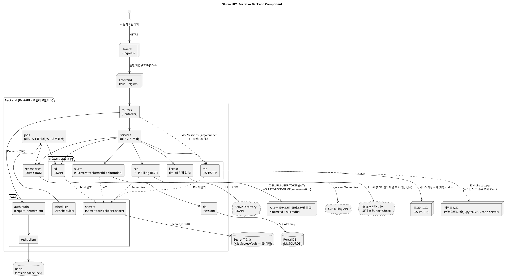

# Architecture — Slurm HPC Portal (Backend)

백엔드의 **컴포넌트 구조**와 **클래스 구조**를 다이어그램으로 정리한다.
설계 근거는 [backend-design.md](backend-design.md), 데이터 모델은 [db-erd.md](db-erd.md), 기능 SoT는 [정의서.md](../정의서.md)(특히 §4.1 연동 경로 매핑).

> **상태(2026-08-06): 구현 완료분을 반영해 갱신함.** 컴포넌트 경계와 외부 연동 경로는 실제
> 코드와 일치한다. 클래스 다이어그램의 시그니처는 여전히 설계 수준이며 정본은 코드다.
> 미구현 컴포넌트: `LicenseClient`/`LicenseService`(A-LM 전부), 티켓(A-OP-05).

---

## 1. 컴포넌트 다이어그램

계층(router→service→repository/client)과 외부 시스템 경계. (backend-design §1.2·§2·§4·§7)

> **인터랙티브 세션 트래픽 경로(중요, 백엔드 WebSocket 브리지)**: 브라우저의 noVNC가
> `WS /sessions/{sid}/connect`로 백엔드에 붙고, 백엔드가 **로그인 노드 SSH의 `direct-tcpip`
> 채널로 워커의 Xvnc(5901~)에 연결해 RFB 바이트를 그대로 중계**한다. 접속 정보의 유일한
> 출처는 세션 Job이 워커에 남기는 `connection.json`이며(홈=공유 NFS), 세션이 살아 있는지는
> **Slurm Job 상태**가 권위 있는 출처다. `interactive_session` 표는 "누가 어떤 클러스터에
> 무엇을 띄웠나"만 기록한다.
>
> **초기 설계(Traefik HTTP provider 폴링 → 컴퓨트 노드 직결)는 채택하지 않았다.**
> Open OnDemand는 정적 프록시 규칙 하나(`ProxyPassMatch ^/node/([^/]+)/(\d+)`)로 경로에서
> 노드·포트를 뽑지만 **Traefik에는 그에 상응하는 수단이 없다**(docs/plan.md §3.3).
> 백엔드가 중계하는 방식은 부수적으로 두 가지를 얻는다 — 워커 host/port가 브라우저에
> 노출되지 않아 열린 프록시가 되지 않고, 소유자 확인을 서버가 매 연결마다 강제한다.
> 그래서 `/internal/gateway/dynamic-config`·`/internal/sessions/{id}/ready`는 **구현되지
> 않았고**, `interactive_session.node_host/node_port/connect_url`도 쓰지 않는다.
> **License 수집 경로**: `license` client는 SSH를 거치지 않고 **백엔드 컨테이너에 내장된 lmutil**로 고객의 FlexLM 벤더 서버(`port@host`)에 직접 TCP 접속한다 — 클러스터 스코프와 무관한 독립 client. 단, A-LM-03(Slurm Licenses 동기화, `sacctmgr add resource`)은 반영 대상 클러스터의 `slurm` client(REST/CLI 폴백)를 통해 이뤄지므로 A-LM-02(수집)와 실행 경로가 다르다.

---

## 2. Slurm 호출 면 (slurmrestd) 매핑

`slurm` client는 **두 API 그룹**을 감싼다. 계정/QOS/association/사용량(= `sacct`/`sacctmgr` 상당)은 slurmdbd 그룹이며, 단순 job submit/cancel은 전체의 일부다. (정의서 §4.1 ①)

### 2.1 slurmctld 그룹 — 제어 (`/slurm/v0.0.41/...`)
| 기능 ID | 경로(대표) | Client 메서드 | Service |
|---|---|---|---|
| U-JB-04·05, A-JB-01 | `GET /jobs`, `GET /job/{id}` | `get_jobs` / `get_job` | JobService |
| U-JB-01·02·03·08 | `POST /job/submit` | `submit_job(spec, as_user)` | JobService |
| U-JB-07, A-JB-02 | `DELETE /job/{id}` | `cancel_job(id, as_user)` | JobService |
| A-JB-02·03 | `POST /job/{id}` (hold/release/priority) | `update_job(id, patch)` | JobService |
| A-ND-01 | `POST /node/{name}` (DRAIN/RESUME/DOWN) | `update_node(name, state, reason)` | NodeService |
| A-ND-02, U-CL-01·02, A-DB-01 | `GET /nodes`, `GET /node/{name}` | `get_nodes` / `get_node` | NodeService |
| A-ND-03 | `GET/POST /partition/{name}` (slurm.conf 반영은 구성관리/CLI) | `get_partitions` / `update_partition` | PartitionService |
| A-ND-04 | `GET/POST/DELETE /reservation[s]` | `list/create/delete_reservation` | ReservationService |
| A-DB-01·03·04 | `GET /ping`, `GET /diag` | `ping` / `diag` | DashboardService |

### 2.2 slurmdbd 그룹 — 회계·관리 (`/slurmdb/v0.0.41/...`, = sacct·sacctmgr·sreport)
| 기능 ID | 경로(대표) | Client 메서드 | Service |
|---|---|---|---|
| A-US-02 | `GET/POST/DELETE /account[s]` | `get/create/delete_account` | AccountService |
| A-US-02·04 | `GET/POST/DELETE /association[s]` (사용자↔계정 N:M, Fairshare share) | `get/create/delete_association` | AccountService |
| A-US-03 | `GET/POST/DELETE /qos` (한도·우선순위·허용/기본 배정) | `get/create/update/delete_qos` | QosService |
| A-US-02·03 | `GET/POST/DELETE /user[s]` (Slurm 사용자·기본계정·기본 QOS) | `get/create/delete_user` | SlurmUserService |
| U-JB-09, A-JB-04, A-RP-03 | `GET /jobs` (회계 이력 = sacct) | `get_accounting_jobs(filter)` | UsageService |
| U-AC-01·02, A-RP-01·02 | association usage·TRES (`sshare`/`sreport` 상당) | `get_usage` / `get_fairshare` | UsageService |
| A-US-05 | `GET /config` (AllowAccounts 등 조회) | `get_config` | AccountService |

> **REST 미지원 op 폴백**(정의서 §4.1): `sreport`/`sshare` 세부 집계·일부 `sacctmgr` op이 목표 slurmrestd 버전에 없으면 **해당 op만 CLI 래핑**(SSH 경유). A-ND-03의 `slurm.conf` 영속화, A-LM-03의 `sacctmgr add resource`(License 동기화)도 동일.

### 2.3 보조 경로 (참고, §1 컴포넌트)
| 경로 | 기능 ID | Client | Service |
|---|---|---|---|
| SSH/SFTP | U-FM-01~04, U-SH, U-IA, U-JB-06(로그 tail) | SshClient / SftpClient | File/Terminal/Interactive/LogService |
| LDAP | A-US-01, C-01 | AdClient | AuthService / UserService(sync) |
| REST(SCP Billing API) | A-BL-01~04 | ScpBillingClient | BillingService |
| FlexLM(lmutil, TCP 직접) | A-LM-01·02·05 | LicenseClient | LicenseService |
| SSH direct-tcpip(RFB 중계) | U-IA-01·02·04 | `TcpTunnel`(paramiko) | SessionService |

> **License 실행 경로 이원화**: A-LM-01·02·05(라이선스 서버 등록·lmstat 수집·사용 모니터링)는 클러스터 무관 — `LicenseClient`가 백엔드에서 FlexLM 벤더 서버로 직접 TCP 접속. **A-LM-03(Slurm Licenses 동기화)만 예외** — 가용 수량을 반영할 **대상 클러스터**의 `SlurmrestdClient`(REST 미지원 시 CLI 폴백)를 통해 `sacctmgr add resource`를 수행하므로 클러스터 스코프.

---

## 3. 클래스 다이어그램

계층 관계: **Service ↔ Repository/Client = 조합(has-a, `o-->`)**, **BaseHttpClient ↔ REST client(SlurmrestdClient·ScpBillingClient) = 상속(is-a, `<|--`)**. `AdClient`(LDAP)·`SshClient`(SSH)는 프로토콜이 다르고 구현체가 각 1개라 베이스 없이 단독이다(§1.4 정정).
slurm client는 **클러스터 단위로 구성**되므로(§2.2) `ClusterClientFactory`가 등록 정보(`cluster`)와 자격증명(`cluster_credential.secret_ref` → Secret 저장소)으로 클러스터별 인스턴스를 만들어 재사용한다.

> **다이어그램 소스**: [class_diagram.puml](class_diagram.puml) — 클래스 다이어그램은 규모가 커서 별도 .puml 파일로 분리했다. 렌더링: `plantuml docs/class_diagram.puml` 또는 VS Code PlantUML 확장(Alt+D).

**요점**
- **REST 공통은 `BaseHttpClient`에 집약**: `base_url`·타임아웃·재시도(멱등 op 한정, backoff)·TLS 검증·**keep-alive 세션 풀**(§2.1)·`request(method, path, params, json, headers)`·상태코드→도메인 예외 매핑(401=Unauthorized). REST를 쓰는 **`SlurmrestdClient`(slurmrestd)와 `ScpBillingClient`(SCP Billing API)가 공유** — `AdClient`(LDAP)·`SshClient`(SSH)는 프로토콜이 다르고 구현체가 각 1개라 베이스 없이 단독 구현(투기적 추상화 배제, §1.4 정정 backend-design 반영).
- **JWT 자격증명 흐름**: Portal DB `cluster_credential.secret_ref` → `SecretStore`(K8s Secret/Vault, §9 미정)에서 실값 해석 → `SlurmTokenProvider`가 클러스터별 캐시 + `exp` 클레임 디코드(만료 사전 알림) + 401 시 재등록 안내(§2.2) → `SlurmrestdClient._headers()`가 매 호출 `X-SLURM-USER-TOKEN`(JWT) + `X-SLURM-USER-NAME`(**서버 사이드에서 인증된 본인만**, §2.3) 구성. SSH 개인키·AD bind 암호도 같은 `SecretStore` 경유(DB엔 참조만).
- **단일 `SlurmrestdClient`, 클러스터별 인스턴스**: slurmctld/slurmdbd는 경로 접두(`/slurm` vs `/slurmdb`)로만 갈리는 동일 엔드포인트·동일 JWT라 client는 하나로 통합하고, `ClusterClientFactory`가 클러스터당 1개 생성·풀링(keep-alive 재사용). 도메인 분리는 service 계층(Job/Node/Partition/Reservation ↔ Account/Qos/SlurmUser/Usage)이 담당하며 양쪽이 이 client를 재사용.
- **세션·권한 캐시**: `require_permission` = 포털 세션 JWT 검증 + Redis `SessionStore`(키 = 난수 `sid`, 신원은 세션 레코드의 `user_guid`가 정본 — username 재사용 시 세션 혼선 방지, 기기별/전체 강제 로그아웃 즉시 반영) + `PermissionCache`(rolePerm TTL 캐시)(§4). 라우터는 `require_permission("qos:modify")`류 permission 문법 유지 → dict→DB 전환에도 무수정(§3.4). 로그인(AD bind→JIT→세션 등록)은 `AuthService`(§3.3·§3.6).
- **REST 미지원 폴백**: `sreport`/`sshare`/일부 `sacctmgr` op·`slurm.conf` 영속화는 `SshClient.exec` CLI 래핑으로 분리 — §2.2 각주.
- **RBAC 초기 상태**: role = `USER`·`ADMIN` 2행, permission = `admin:access`(ADMIN 페이지 접근 여부) 1행, 매핑 = ADMIN→admin:access뿐. 테이블 구조(N:M)는 향후 role 추가(예: PI)·`resource:action` 세분화를 **행 추가만으로** 수용(§3.4) — 라우터가 처음부터 permission 문법이므로 세분화 시에도 무수정.
- **경계 유지**: account/qos/association은 slurmdbd 소유(Portal DB 아님). `models`는 db-erd.md의 **포털 소유 20개 엔티티와 1:1 동기**(속성 포함). 타입/길이·인덱스·관계(FK) 상세의 SoT는 db-erd.md다.
- **인터랙티브 세션(구현됨, `SessionService`)**: 세션은 **Slurm 배치 Job**이다. 제출은
  slurmrestd, 컨테이너는 워커에서 apptainer로 뜨고, 접속 정보는 Job이 워커에 남기는
  `connection.json`(공유 홈)을 로그인 노드 경유 SFTP로 읽는다. 브라우저 noVNC ↔ 워커 Xvnc
  사이는 **백엔드가 `WS /sessions/{sid}/connect`에서 RFB 바이트를 중계**한다
  (`TcpTunnel` = SSH `direct-tcpip`). 두 출처를 섞지 않는다 — **살아 있는가는 Slurm Job
  상태**, **어디로 붙는가는 `connection.json`**. 노드가 죽으면 정리 훅이 돌지 않아 파일이
  남기 때문이다(실측).
  - **워커 자격증명이 필요 없다**: `direct-tcpip`의 목적지는 로그인 노드의 sshd가 해석한다
    (`ssh -L`과 같은 원리). 포털은 로그인 노드 자격증명만 갖는다.
  - **접속 위치는 브라우저에 내보내지 않는다**(열린 프록시 방지). 세션 ID만 받고 서버가
    소유자를 확인한 뒤 터널을 연다.
  - U-IA-03(JupyterLab)·U-IA-05(공유)는 미구현. 앱 추가는 컨테이너 기동 스크립트의
    `PORTAL_APP` 분기만 늘리면 되고 세션·프록시 계층은 공유한다.
- **License(신규)**: `LicenseService`가 `LicenseClient`(독립, REST도 SSH도 아님)로 고객 FlexLM 서버에 **직접 TCP 접속**(`lmutil`은 백엔드 컨테이너에 내장된 배포 단위 바이너리, 서버별 경로 설정 아님). A-LM-03만 예외로 대상 클러스터의 `SlurmrestdClient`를 사용(§2.3 각주).
- **부트스트랩 상태 확인(신규)**: `AuthService.is_bootstrapped()` — `ad_connection.seed_admin_guid` 존재 여부로 판정, `GET /auth/setup-status`(공개)로 노출. 판정 후 `bootstrap_required=false`면 `POST /auth/setup`은 서버측에서 하드 거부(1회용 잠금).
- **Job 사전검증(신규)**: `JobService.validate(user, spec)` — 신규 Slurm 호출 없이 `SlurmrestdClient.ping()`(연결성) + 로컬 `#SBATCH` 파서 + 기존 `AccountService`/`QosService`의 association·AllowAccounts 조회(파티션 권한) + `PartitionService.get_partitions()`의 MaxTime(walltime 한도)을 조합. **예상 대기시간**(`sbatch --test-only` 상당)은 slurmrestd v0.0.41 REST 지원 여부 **미확인**(§9 폴백 후보) — 확인 전까지 `JobService`에 포함하지 않는다. **클러스터 간 비교 추천**은 "선택된 클러스터로 스코프" 원칙과 배치되어 **범위 결정 보류**, 이번 설계에 포함하지 않는다.

---

## 4. 렌더링 방법
- **컴포넌트 다이어그램**(§1, 본 문서 내 코드 블록): `plantuml docs/Architecture.md` 또는 VS Code **PlantUML** 확장(Alt+D) — Graphviz 또는 내장 서버 필요
- **클래스 다이어그램**(§3, 별도 파일): `plantuml docs/class_diagram.puml` 또는 [class_diagram.puml](class_diagram.puml)을 열고 Alt+D
- 온라인: PlantUML 서버(www.plantuml.com/plantuml)에 붙여넣기
