# DB 모델 ERD — Slurm HPC Portal (Portal DB)

포털 백엔드가 소유하는 **Portal DB(MySQL)** 의 엔티티 관계도. 설계 근거는 [backend-design.md](backend-design.md), 기능 SoT는 [정의서.md](../정의서.md).

> **경계(중요)**: Slurm의 **account·QOS·association·slurm user 는 각 클러스터의 `slurmdbd`(외부)에 존재**하며 `slurmrestd`로 접근한다 — **Portal DB 테이블이 아니다**(클러스터별 독립 slurmdbd). **session·role-permission 캐시·이미지 목록 캐시·동기화 분산락은 Redis** 관리로 DB 밖이다. 아래 ERD는 포털이 직접 소유하는 테이블만 포함한다.

> **정본은 코드다(2026-08-11 대조)**: 이 문서는 `backend/app/models/` 22개 모델과
> 마이그레이션 `0001`~`0019`에 맞춰 갱신했다. 타입·길이·제약이 어긋나면 모델이 이긴다.

---

## 1. ERD (PlantUML)

```plantuml
@startuml portal-db-erd
hide circle
skinparam linetype ortho
skinparam shadowing false
skinparam roundcorner 6
title Slurm HPC Portal — Portal DB (MySQL)

' ===== 신원 & 인가 (C-01 / C-02) =====
entity "user" as user {
  *ad_object_guid : VARCHAR(36) <<PK>>
  --
  *username : VARCHAR(64) <<UNIQUE,IDX>>  ' sAMAccountName
  display_name : VARCHAR(128)
  email : VARCHAR(256)
  role_id : INT <<FK>>
  default_cluster_id : INT <<FK,NULL>>
  is_active : BOOL
  notify_prefs : JSON                  ' 알림 수신 설정(이메일/푸시/SMS, U-AC-03)
  last_login_at : DATETIME
  deleted_at : DATETIME <<NULL>>       ' soft delete
  created_at : DATETIME
  updated_at : DATETIME
}

entity "role" as role {
  *id : INT <<PK>>
  --
  *code : VARCHAR(32) <<UNIQUE>>       ' 초기 USER·ADMIN 2행(향후 추가 가능, 예: PI)
  name : VARCHAR(64)
  description : VARCHAR(255)
}

entity "permission" as perm {
  *id : INT <<PK>>
  --
  *code : VARCHAR(64) <<UNIQUE>>       ' 초기 admin:access 1행 → resource:action 세분화(job:cancel 등)
  description : VARCHAR(255)
}

entity "role_permission" as rp {
  *role_id : INT <<PK,FK>>
  *permission_id : INT <<PK,FK>>       ' 초기 ADMIN→admin:access 1행
}

' ===== 클러스터 & 시크릿 (C-03 / A-CL) =====
entity "cluster" as cluster {
  *id : INT <<PK>>
  --
  name : VARCHAR(64) <<UNIQUE,NULL>>   ' slurm.conf ClusterName — 등록 시엔 NULL, REST 연결 테스트가 채운다
  alias : VARCHAR(255)                 ' 사람이 붙인 이름. 이름이 확인되기 전까지의 표시명
  slurmrestd_url : VARCHAR(255)
  api_version : VARCHAR(16)            ' v0.0.43 고정 — SUPPORTED_API_VERSIONS가 이 값만 받는다
  auth_method : VARCHAR(16)            ' jwt 고정 (munge는 범위 밖 — 정의서 §4.1)
  login_node : VARCHAR(128)           ' SSH (웹터미널·SFTP 공용)
  ssh_port : INT                      ' 기본 22
  ssh_account : VARCHAR(64)           ' 서비스 계정 (제한 sudo)
  home_base : VARCHAR(255)            ' 홈의 상위 경로(예: /home). 홈 = 이 아래 사용자명. NULL이면 NSS 자동 인식
                                      ' 앱 이미지 위치도 여기서 파생 → {home_base}/.portal/images
  is_default : BOOL
  is_active : BOOL
  last_health_at : DATETIME           ' A-CL-01 마지막 헬스체크 (NULL=미확인)
  last_health_ok : BOOL               ' 마지막 REST 연결 결과
  created_at : DATETIME
  updated_at : DATETIME
}

entity "cluster_credential" as ccred {
  *id : INT <<PK>>
  --
  *cluster_id : INT <<FK>>
  kind : VARCHAR(16)                   ' SLURM_JWT / SSH_KEY
  secret_ref : VARCHAR(255)            ' Secret 저장소 참조(값 평문 저장 금지)
  expires_at : DATETIME <<NULL>>       ' JWT exp (만료 알림용)
  created_at : DATETIME
}

' ===== AD 연결 (A-US-01, 단일) =====
entity "ad_connection" as ad {
  *id : INT <<PK>>                     ' 단일 행
  --
  ldaps_url : VARCHAR(255)
  base_dn : VARCHAR(255)
  bind_account : VARCHAR(128)
  bind_secret_ref : VARCHAR(255)       ' Secret 저장소 참조
  allowed_group : VARCHAR(255)         ' memberOf 필터
  id_attribute : VARCHAR(32)           ' sAMAccountName / uid
  sync_interval : VARCHAR(16)
  last_sync_at : DATETIME
  last_sync_result : VARCHAR(255)
  seed_admin_guid : VARCHAR(36) <<NULL>>  ' 최초 setup seed
  created_at : DATETIME
  updated_at : DATETIME
}

' ===== 포털 콘텐츠 =====
entity "notice" as notice {
  *id : INT <<PK>>
  --
  title : VARCHAR(255)
  body : TEXT
  banner_enabled : BOOL
  start_at : DATETIME
  end_at : DATETIME
  created_by : VARCHAR(36) <<FK>>
  created_at : DATETIME
}

entity "api_token" as apitok {
  *id : INT <<PK>>
  --
  user_guid : VARCHAR(36) <<FK>>
  name : VARCHAR(64)                   ' 사람이 알아볼 이름
  token_hash : VARCHAR(64) <<UNIQUE,IDX>>  ' sha256 — 원문은 저장하지 않는다
  prefix : VARCHAR(16)                 ' 목록 식별용 앞자리(비밀 아님)
  created_at : DATETIME
  expires_at : DATETIME                ' NULL = 만료 없음
  last_used_at : DATETIME
  revoked_at : DATETIME
}

entity "app_access" as appacc {
  *id : INT <<PK>>
  --
  cluster_id : INT <<FK>>
  kind : VARCHAR(16)                   ' interactive | batch
  app_id : VARCHAR(32)                 ' 코드 카탈로그의 앱 id — FK가 아니다
  account : VARCHAR(64)                ' slurmdbd 계정명 참조(포털 표가 아니다)
  created_at : DATETIME
  --
  UNIQUE uq_app_access (cluster_id, kind, app_id, account)
}

entity "app_catalog" as appcat {
  *id : INT <<PK>>
  --
  kind : VARCHAR(16)                   ' interactive | batch
  app_id : VARCHAR(32)                 ' 코드 카탈로그의 앱 id — FK가 아니다
  name : VARCHAR(128)
  vendor : VARCHAR(128)
  version : VARCHAR(32)
  image_file : VARCHAR(128)            ' SIF/SQSH 파일명만. 파일은 클러스터의 {home_base}/.portal/images
  icon_file : VARCHAR(64)              ' 파일명만. 실제 파일은 app_icon_dir, URL은 서버가 만든다
  description : TEXT
  created_at : DATETIME
  updated_at : DATETIME
  --
  UNIQUE uq_app_catalog_kind_app (kind, app_id)
}

entity "ticket" as ticket {
  *id : INT <<PK>>
  --
  title : VARCHAR(255)
  body : TEXT
  requester_guid : VARCHAR(36) <<FK>>
  assignee_guid : VARCHAR(36) <<FK,NULL>>
  status : VARCHAR(16)                 ' open / in_progress / resolved
  job_id : VARCHAR(32) <<NULL>>
  created_at : DATETIME
  resolved_at : DATETIME <<NULL>>
}

entity "audit_log" as audit {
  *id : BIGINT <<PK>>
  --
  at : DATETIME <<IDX>>
  actor_guid : VARCHAR(36) <<FK,NULL>>
  actor_role : VARCHAR(32)
  action : VARCHAR(64)                 ' JOB_SUBMIT / NODE_DOWN ...
  target_cluster_id : INT <<FK,NULL>>
  target : VARCHAR(128)
  detail : VARCHAR(512)
  ip : VARCHAR(45)
}

' ===== Billing (A-BL) =====
entity "billing_config" as bcfg {
  *id : INT <<PK>>                     ' 단일 행
  --
  api_endpoint : VARCHAR(255)          ' 서버가 채운다: https://costexplorer.e.samsungsdscloud.com
                                       ' (costexplorer는 리전 없는 전역 호스트 — clients/scp/client.py)
  scp_account_id : VARCHAR(32)         ' 연결 확인 시 응답 첫 행에서 채운다(표시 전용)
  access_key : VARCHAR(128)            ' 식별용. 서명에 쓰는 secret_key는 DB에 없다
  secret_ref : VARCHAR(255)            ' Secret 저장소 참조 (scp/secret_key)
  collect_interval : VARCHAR(16)       ' [미사용] 수집 배치가 아직 없다
  monthly_alert_krw : BIGINT
  last_verified_at : DATETIME
}

entity "billing_rule" as brule {
  *id : INT <<PK>>
  --
  kind : VARCHAR(16)                   ' billing_item / category / resource_name / region / account
  condition : VARCHAR(255)             ' billing_item_id = OBJECT_STORAGE, resource_name LIKE hpc-*
  mapping_label : VARCHAR(128)         ' archive / staging ...
  is_active : BOOL
  sort_order : INT
}

entity "billing_snapshot" as bsnap {
  *id : BIGINT <<PK>>
  --
  period : VARCHAR(7)                  ' YYYY-MM
  dimension : VARCHAR(64)              ' tag/type/일자
  cost_krw : BIGINT
  collected_at : DATETIME
}

' ===== 인터랙티브 세션 (U-IA-04, 정의서 §4.1③) =====
entity "interactive_session" as isession {
  *id : INT <<PK>>
  --
  *user_guid : VARCHAR(36) <<FK>>
  *cluster_id : INT <<FK>>
  app_type : VARCHAR(16)               ' 코드 카탈로그의 앱 id — desktop / paraview / jupyter (PORTAL_APP)
  slurm_job_id : VARCHAR(32)           ' 세션 Job (종료=scancel via REST)
  status : VARCHAR(16)                 ' active / ended (컬럼 default 'starting'은 쓰이지 않는다)
  node_host : VARCHAR(128)             ' [미사용] 초기 설계 잔재
  node_port : INT                      ' [미사용]
  connect_url : VARCHAR(255)           ' [미사용]
  created_at : DATETIME
  terminated_at : DATETIME <<NULL>>
}

' ===== 포털 운영 설정 (A-OP-04, 단일) =====
entity "portal_setting" as psetting {
  *id : INT <<PK>>                     ' 단일 행
  --
  poll_interval_sec : INT              ' 상태 폴링 주기(C-04 ≤30초)
  session_timeout_min : INT
  smtp_host : VARCHAR(128)
  smtp_port : INT
  smtp_sender : VARCHAR(128)
  webhook_url : VARCHAR(255)
  updated_at : DATETIME
}

' ===== License (A-LM) =====
entity "license_server" as lserver {
  *id : INT <<PK>>
  --
  *name : VARCHAR(64) <<UNIQUE>>
  host : VARCHAR(128)                  ' port@host 의 host
  port : INT
  vendor_daemon : VARCHAR(64)
  collect_interval : VARCHAR(16)       ' lmstat 수집 주기
  is_active : BOOL
  last_check_at : DATETIME
  last_check_result : VARCHAR(255)
  created_at : DATETIME
  updated_at : DATETIME
}

entity "license_feature_snapshot" as lfsnap {
  *id : BIGINT <<PK>>
  --
  *server_id : INT <<FK>>
  feature : VARCHAR(128)
  total : INT
  in_use : INT
  collected_at : DATETIME
}

' ===== 리포트 (A-RP-04·05) =====
entity "report_schedule" as rsched {
  *id : INT <<PK>>                     ' 단일 행
  --
  recipients : VARCHAR(512)            ' 수신자(콤마 구분)
  cycle : VARCHAR(16)                  ' weekly / monthly / quarterly
  format : VARCHAR(8)                  ' pdf / excel / csv
  scope : VARCHAR(32)                  ' 전체 요약 / 계정별 / 사용자별
  is_active : BOOL
  updated_at : DATETIME
}

entity "chargeback_rate" as crate {
  *id : INT <<PK>>
  --
  *resource : VARCHAR(16) <<UNIQUE>>   ' cpu / gpu
  rate_krw : INT                       ' 예: CPU 12원/core·h, GPU 950원/gpu·h
  unit : VARCHAR(16)                   ' core·h / gpu·h
  updated_at : DATETIME
}

' ===== 관계 =====
role ||--o{ user : role_id
role ||--o{ rp
perm ||--o{ rp
cluster |o--o{ user : default_cluster_id
cluster ||--o{ ccred : cluster_id
cluster |o--o{ audit : target_cluster_id
cluster ||--o{ appacc : cluster_id
user ||--o{ notice : created_by
user ||--o{ apitok : owns
user ||--o{ ticket : requester_guid
user |o--o{ ticket : assignee_guid
user ||--o{ audit : actor_guid
user ||--o{ isession : user_guid
cluster ||--o{ isession : cluster_id
lserver ||--o{ lfsnap : server_id

' ===== 외부 경계 (Portal DB 아님) =====
package "«external» slurmdbd (클러스터별)" <<Cloud>> {
  entity "slurm account" as sacct #eeeeee
  entity "slurm qos" as sqos #eeeeee
  entity "association\n(cluster,account,user,partition)" as sassoc #eeeeee
}
cluster ..> sacct : slurmrestd (JWT)
note bottom of sassoc
  account·QOS·association·slurm user 는
  slurmdbd 소유 → slurmrestd 로 CRUD.
  사용자↔계정 N:M, 허용/기본 QOS 배정도 여기.
  포털 DB에 미러링하지 않음(필요 시 캐시만).
end note

note as N_redis
  <b>Redis (DB 밖)</b> — core/redis_client.py
  • session:{sid} → {guid, username}  (신원의 정본)
  • user_sessions:{guid} → {sid...}  (강제 로그아웃 역인덱스)
  • refresh:{sha256(token)}  (refresh 토큰, 원문 미저장)
  • rolePerm:{role_code}  (권한 캐시, TTL + 명시적 무효화)
  • appImages:{cluster_id}  (클러스터 이미지 목록 60초 — 실패는 캐시하지 않는다)
  • sync:lock:ad  (AD 동기화 중복 실행 방지)
end note

note as N_nodb
  <b>DB에 없는 것</b>
  • 앱의 <b>실행 방식</b>(entry·transport·파라미터) → 코드 카탈로그
    services/session_apps.py · batch_apps.py
  • 세션 <b>접속 정보</b>(워커 host/port/비밀번호) → 워커의 connection.json
  • 앱 이미지 <b>파일</b> → 각 클러스터의 {home_base}/.portal/images (SSH로 조회)
end note

@enduml
```



---

## 2. 엔티티 설명

### 신원 · 인가
| 테이블 | 목적 | 근거 |
|---|---|---|
| `user` | AD 사용자의 포털 표현. **PK=objectGUID(불변)**, `username`=sAMAccountName(변경/재사용 가능). soft delete. | backend §3.2, C-02 |
| `role` / `permission` / `role_permission` | RBAC. **초기 seed: role 2행(`USER`/`ADMIN`) · permission 1행(`admin:access`=ADMIN 페이지 접근 여부) · 매핑 1행(ADMIN→admin:access)**. 향후 role 추가(예: PI, 정의서 §1.2)·`resource:action` 세분화(`job:cancel` 등)를 **스키마 변경 없이 행 추가**로 수용 — 라우터가 처음부터 `require_permission("...")` 문법이라 세분화해도 라우터는 안 고친다. 역할↔권한은 **AD 그룹이 아니라 포털이 소유한다**(AD 스키마를 건드리지 않는다). seed는 마이그레이션 `0002`가 넣는다. | backend §3.4, 정의서 §1.2 |

### 클러스터 · 연동
| 테이블 | 목적 | 근거 |
|---|---|---|
| `cluster` | 등록 클러스터(엔드포인트·API버전·SSH 접속·홈 상위 경로·기본 여부). 클러스터별 독립 slurmdbd. **경로 템플릿 컬럼은 없다** — 허용 루트를 홈으로 좁히면서 지웠다(마이그레이션 `0006`). `home_base`는 홈뿐 아니라 **앱 이미지 디렉터리의 파생 기준**이기도 하다(`{home_base}/.portal/images`, `services/app_images.image_dir`). | C-03, A-CL, §4.1 |
| `cluster_credential` | 클러스터 JWT/SSH 키의 **Secret 참조 + 만료(exp)**. 값은 Secret 저장소, DB엔 참조만. | backend §2.2, §6 |
| `ad_connection` | 단일 AD 연결 설정 + seed admin. Bind 암호는 Secret 참조. | A-US-01, C-02 |

### 포털 콘텐츠 · 감사 · License · Billing
| 테이블 | 목적 | 근거 |
|---|---|---|
| `notice` | 공지(배너 노출·기간). **클러스터 스코프가 없다** — 공지는 포털 전체 대상이라 `target_cluster_id`를 지웠다(마이그레이션 `0011`). 특정 클러스터 점검이면 제목·본문에 적어야 한다. | U-CL-03 / A-OP-01 |
| `api_token` | 기계 클라이언트용 장수명 자격증명. **원문 미저장**(sha256), 폐기·만료 가능. | C-01 |
| `interactive_session` | 인터랙티브 앱 세션 **대장(臺帳)** — "누가 어떤 클러스터에 무엇을 띄웠나"만 기록한다. VNC(desktop·paraview)와 HTTP(jupyter) 세션이 같은 표를 쓴다 — 붙는 방식은 코드 카탈로그의 `transport`가 정한다. **접속 정보(호스트·포트·비밀번호)는 저장하지 않는다**: 유일한 출처는 세션 Job이 워커에 남기는 `connection.json`(공유 홈)이고, 살아 있는지는 **Slurm Job 상태**가 권위 있는 출처다(노드가 죽으면 정리 훅이 안 돌아 파일이 남는다 — 실측). `node_host`/`node_port`/`connect_url`은 채택하지 않은 초기 설계(Traefik 폴링 라우트)의 **잔재로 사용하지 않는다** — 채우면 출처가 둘이 되어 어긋난다. 종료는 REST `scancel` + 상태 변경. | U-IA-04, Architecture.md §1 |
| `app_access` | 앱을 쓸 수 있는 Slurm 계정 배정. **허용 목록이고 행이 없으면 전원 허용**이다 — 기본이 잠김이면 표를 만든 순간 모든 앱이 멈춘다. `app_id`는 코드 카탈로그(`session_apps.py`·`batch_apps.py`)의 id, `account`는 slurmdbd 계정명의 **문자열 참조**다(계정은 포털 표가 아니다). 배정된 앱은 목록에서 잠기고, 제출된 Job도 그 계정으로 실행된다. | U-IA-01 · U-JB-13 / A-US-02 |
| `app_catalog` | 앱의 **정보**(아이콘·벤더·버전·이미지 위치·설명). 아이콘·컨테이너 이미지 모두 **파일명만** 담는다 — 경로는 서버가 만든다. 이미지의 **출처**는 담지 않는다(`image_ref`는 마이그레이션 `0019`에서 제거) — 포털이 레지스트리에서 받지 않고 관리자가 밖에서 만들어 올려놓는다. 적어 두려면 `description`에 쓴다. 아이콘은 `app_icon_dir`(기본 `/home/.portal/app-icons`), 이미지는 **클러스터마다 다르다**: `cluster.home_base` 아래 `.portal/images`로 파생하고 비었을 때만 `app_image_dir`로 폴백한다. 배포 위치가 DB로 새지 않는다. 관리자가 SCR-15에서 CRUD한다. **실행 방식은 여기 없다** — 기동 스크립트·transport·파라미터 스키마는 코드 카탈로그가 정본이고, 이미지와 실행 커맨드는 함께 바뀌어 코드 배포를 벗어날 수 없다(`job_template` 제거 근거와 같다). `(kind, app_id)`가 코드 카탈로그로 가는 연결 키이며 FK가 아니다 — 코드에 없는 앱도 미리 등록할 수 있고, 등록이 없는 앱은 코드의 이름·설명이 쓰인다. | A-OP-02 |
| `ticket` | **[미구현 — 표만 있다]** 헬프데스크 티켓(요청자/담당자). | U-AC-04 / A-OP-05 |
| `audit_log` | 제어성 액션 감사. | C-05 / A-OP-03 |
| `portal_setting` | 세션 정책(폴링 주기·타임아웃)·알림 채널(SMTP/웹훅). 단일 행. 행이 없으면 `session_idle_default_minutes`(기본 480분)로 떨어진다. | A-OP-04 |
| `license_server` | **[미구현 — 표만 있다]** FlexLM 서버 등록(host/port·벤더 데몬·수집 주기). 설계상 `LicenseClient`가 백엔드 내장 lmutil로 **직접 TCP 접속**(SSH 아님, 클러스터 무관)하지만 **그 client도 service도 아직 없다**. | A-LM-01 |
| `license_feature_snapshot` | **[미구현 — 표만 있다]** lmstat 수집 결과(Feature별 total/in_use). | A-LM-02·05 |
| `report_schedule` | **[미구현 — 표만 있다]** 정기 리포트 발송 설정(수신자·주기·형식·범위). 단일 행. | A-RP-04 |
| `chargeback_rate` | **[미구현 — 표만 있다]** 과금 요율(자원별 원/단위시간). | A-RP-05 |
| `billing_config` | SCP 비용 조회 연동. **`scpv2` SDK 래퍼**(`ScpBillingClient`)가 서명·엔드포인트를 처리한다 — `access_key`는 식별용으로 DB에, secret key는 Secret 저장소(`scp/secret_key`)에 둔다. `api_endpoint`는 서버가 채우는 표시값이고, `collect_interval`은 수집 배치가 없어 아직 쓰이지 않는다. | A-BL-01 |
| `billing_rule` | 자원 식별 규칙(billing_item_id·service_category·resource_name·region). SCP 응답에 Tag 없음. | A-BL-02 |
| `billing_snapshot` | **[미구현 — 표만 있다]** 수집 비용 이력. 현재 비용 화면은 SCP를 **매번 조회**하고 저장하지 않는다. | A-BL-03·04 |

---

## 3. 설계 노트
- **objectGUID PK**: sAMAccountName 재사용에 의한 권한 상속 사고 방지. 로그인 시 GUID로 매칭, username만 다르면 개명(role 유지), GUID 다르면 재프로비저닝.
- **Secret 비저장**: AD Bind 암호·Slurm JWT·SSH 개인키·SCP Secret Key는 **Secret 저장소**에 두고 DB엔 `*_ref` 참조만. 화면 재표시 안 함.
- **Slurm 엔티티 외부화**: account/QOS/association은 slurmdbd 소유 → 포털은 slurmrestd로 CRUD, 미러링 없음. 사용자↔계정 N:M, 허용/기본 QOS 배정도 slurmdbd에 반영.
- **단일 행 테이블**: `ad_connection`·`billing_config`·`portal_setting`·`report_schedule`은 현재 단일 행. 다중화 필요 시 FK 확장.
- **RBAC 초기 seed**: role=`USER`·`ADMIN` 2행, permission=`admin:access` 1행(ADMIN에만 매핑). 구조는 N:M 확장 대비이며, role/permission 추가는 스키마 변경 없이 **행 삽입만**으로 가능.
- **Redis 분리**: session/캐시/락은 MySQL 밖(멀티 replica 일관성).
- **표만 있고 코드가 없는 여섯**(`ticket`·`license_server`·`license_feature_snapshot`·
  `report_schedule`·`chargeback_rate`·`billing_snapshot`)은 **의도적으로 남긴다.** 전부
  정의서에 있는 기능의 선행 스키마이고 기능이 아직 안 만들어졌을 뿐이다 — 근거와 목록의
  정본은 [backend/app/models/ops.py](../backend/app/models/ops.py) 머리말이고,
  `test_tables_without_code_are_the_documented_ones`가 목록의 표류를 막는다.
  반대로 `job_template`은 "등록해도 쓰는 곳이 없는" 상태여서 표까지 지웠다(마이그레이션 `0012`).
- **컬럼을 지운 이력**(같은 판단의 연속): `user_ssh_key`(`0005`) · `cluster.path_tpl`(`0006`) ·
  `notice.target_cluster_id`(`0011`) · `job_template`(`0012`) · `cluster.image_repository`(`0017`) ·
  `app_catalog.image_ref`(`0019`). **쓰지 않는 칸은 남기지 않는다** — 남으면 코드가 없는
  개념을 스키마가 계속 말한다.

---

## 4. 렌더링 방법
PlantUML 코드 블록을 렌더링해 이미지로 확인:
- VS Code: **PlantUML** 확장(Alt+D 미리보기) — Graphviz 또는 내장 서버 필요
- CLI: `plantuml docs/db-erd.md` (md 내 ```plantuml 블록 추출 지원 버전) 또는 코드만 `.puml`로 저장 후 `plantuml db-erd.puml`
- 온라인: PlantUML 서버(www.plantuml.com/plantuml)에 붙여넣기

> ERD는 설계 초안이다. 컬럼 타입/길이·인덱스·제약은 구현 시 마이그레이션(Alembic 등)에서 확정한다.
