# DB 모델 ERD — Slurm HPC Portal (Portal DB)

포털 백엔드가 소유하는 **Portal DB(MySQL)** 의 엔티티 관계도. 설계 근거는 [backend-design.md](backend-design.md), 기능 SoT는 [정의서.md](../정의서.md).

> **경계(중요)**: Slurm의 **account·QOS·association·slurm user 는 각 클러스터의 `slurmdbd`(외부)에 존재**하며 `slurmrestd`로 접근한다 — **Portal DB 테이블이 아니다**(클러스터별 독립 slurmdbd). **session·role-permission 캐시·동기화 분산락은 Redis** 관리로 DB 밖이다. 아래 ERD는 포털이 직접 소유하는 테이블만 포함한다.

---

## 1. ERD (PlantUML)

```plantuml
@startuml portal-db-erd
hide circle
skinparam linetype ortho
skinparam shadowing false
skinparam roundcorner 6
title Slurm HPC Portal — Portal DB (MySQL)

' ===== 신원 & 인가 (C-01 / C-02) =====
entity "user" as user {
  *ad_object_guid : CHAR(36) <<PK>>
  --
  *username : VARCHAR(64) <<UNIQUE>>   ' sAMAccountName
  display_name : VARCHAR(128)
  email : VARCHAR(256)
  role_id : INT <<FK>>
  default_cluster_id : INT <<FK,NULL>>
  is_active : BOOL
  last_login_at : DATETIME
  deleted_at : DATETIME <<NULL>>       ' soft delete
  created_at : DATETIME
  updated_at : DATETIME
}

entity "role" as role {
  *id : INT <<PK>>
  --
  *code : VARCHAR(32) <<UNIQUE>>       ' USER / ADMIN
  name : VARCHAR(64)
  description : VARCHAR(255)
}

entity "permission" as perm {
  *id : INT <<PK>>
  --
  *code : VARCHAR(64) <<UNIQUE>>       ' resource:action (job:cancel)
  description : VARCHAR(255)
}

entity "role_permission" as rp {
  *role_id : INT <<PK,FK>>
  *permission_id : INT <<PK,FK>>
}

entity "user_ssh_key" as ukey {
  *id : INT <<PK>>
  --
  *user_guid : CHAR(36) <<FK>>
  label : VARCHAR(64)
  public_key : TEXT
  created_at : DATETIME
}

' ===== 클러스터 & 시크릿 (C-03 / A-CL) =====
entity "cluster" as cluster {
  *id : INT <<PK>>
  --
  *name : VARCHAR(64) <<UNIQUE>>       ' slurm.conf ClusterName
  description : VARCHAR(255)
  slurmrestd_url : VARCHAR(255)
  api_version : VARCHAR(16)            ' v0.0.41
  auth_method : VARCHAR(16)            ' jwt / munge
  login_node : VARCHAR(128)           ' SSH (웹터미널·SFTP 공용)
  ssh_port : INT                      ' 기본 22
  ssh_account : VARCHAR(64)           ' 서비스 계정 (제한 sudo)
  group_path_tpl : VARCHAR(255)       ' /group/{group}
  scratch_path_tpl : VARCHAR(255)     ' /scratch/{user}
  is_default : BOOL
  is_active : BOOL
  created_at : DATETIME
  updated_at : DATETIME
}

entity "cluster_credential" as ccred {
  *id : INT <<PK>>
  --
  *cluster_id : INT <<FK>>
  kind : VARCHAR(16)                   ' SLURM_JWT / SSH_KEY
  secret_ref : VARCHAR(255)            ' Secret 저장소 참조(값 평문 저장 금지)
  expires_at : DATETIME <<NULL>>       ' JWT exp (만료 알림용)
  created_at : DATETIME
}

' ===== AD 연결 (A-US-01, 단일) =====
entity "ad_connection" as ad {
  *id : INT <<PK>>                     ' 단일 행
  --
  ldaps_url : VARCHAR(255)
  base_dn : VARCHAR(255)
  bind_account : VARCHAR(128)
  bind_secret_ref : VARCHAR(255)       ' Secret 저장소 참조
  allowed_group : VARCHAR(255)         ' memberOf 필터
  id_attribute : VARCHAR(32)           ' sAMAccountName / uid
  sync_interval : VARCHAR(16)
  last_sync_at : DATETIME
  last_sync_result : VARCHAR(255)
  seed_admin_guid : CHAR(36) <<NULL>>  ' 최초 setup seed
  created_at : DATETIME
  updated_at : DATETIME
}

' ===== 포털 콘텐츠 =====
entity "notice" as notice {
  *id : INT <<PK>>
  --
  title : VARCHAR(255)
  body : TEXT
  target_cluster_id : INT <<FK,NULL>>  ' NULL=전체
  banner_enabled : BOOL
  start_at : DATETIME
  end_at : DATETIME
  created_by : CHAR(36) <<FK>>
  created_at : DATETIME
}

entity "job_template" as tpl {
  *id : INT <<PK>>
  --
  name : VARCHAR(128)
  type : VARCHAR(16)                   ' interactive / batch
  version : VARCHAR(16)
  params : JSON
  is_public : BOOL
  created_by : CHAR(36) <<FK>>
  created_at : DATETIME
  updated_at : DATETIME
}

entity "ticket" as ticket {
  *id : INT <<PK>>
  --
  title : VARCHAR(255)
  body : TEXT
  requester_guid : CHAR(36) <<FK>>
  assignee_guid : CHAR(36) <<FK,NULL>>
  status : VARCHAR(16)                 ' open / in_progress / resolved
  job_id : VARCHAR(32) <<NULL>>
  created_at : DATETIME
  resolved_at : DATETIME <<NULL>>
}

entity "audit_log" as audit {
  *id : BIGINT <<PK>>
  --
  at : DATETIME
  actor_guid : CHAR(36) <<FK>>
  actor_role : VARCHAR(32)
  action : VARCHAR(64)                 ' JOB_SUBMIT / NODE_DOWN ...
  target_cluster_id : INT <<FK,NULL>>
  target : VARCHAR(128)
  detail : VARCHAR(512)
  ip : VARCHAR(45)
}

' ===== Billing (A-BL) =====
entity "billing_config" as bcfg {
  *id : INT <<PK>>                     ' 단일 행
  --
  api_endpoint : VARCHAR(255)
  scp_project_id : VARCHAR(64)
  access_key : VARCHAR(128)
  secret_ref : VARCHAR(255)            ' Secret 저장소 참조
  collect_interval : VARCHAR(16)
  monthly_alert_krw : BIGINT
  last_verified_at : DATETIME
}

entity "billing_rule" as brule {
  *id : INT <<PK>>
  --
  kind : VARCHAR(8)                    ' Tag / Type
  condition : VARCHAR(255)             ' hpc-role = archive
  mapping_label : VARCHAR(128)
  is_active : BOOL
  sort_order : INT
}

entity "billing_snapshot" as bsnap {
  *id : BIGINT <<PK>>
  --
  period : CHAR(7)                     ' YYYY-MM
  dimension : VARCHAR(64)              ' tag/type/일자
  cost_krw : BIGINT
  collected_at : DATETIME
}

' ===== 관계 =====
role ||--o{ user : role_id
role ||--o{ rp
perm ||--o{ rp
user ||--o{ ukey : user_guid
cluster |o--o{ user : default_cluster_id
cluster ||--o{ ccred : cluster_id
cluster |o--o{ notice : target_cluster_id
cluster |o--o{ audit : target_cluster_id
user ||--o{ notice : created_by
user ||--o{ tpl : created_by
user ||--o{ ticket : requester_guid
user |o--o{ ticket : assignee_guid
user ||--o{ audit : actor_guid

' ===== 외부 경계 (Portal DB 아님) =====
package "«external» slurmdbd (클러스터별)" <<Cloud>> {
  entity "slurm account" as sacct #eeeeee
  entity "slurm qos" as sqos #eeeeee
  entity "association\n(cluster,account,user,partition)" as sassoc #eeeeee
}
cluster ..> sacct : slurmrestd (JWT)
note bottom of sassoc
  account·QOS·association·slurm user 는
  slurmdbd 소유 → slurmrestd 로 CRUD.
  사용자↔계정 N:M, 허용/기본 QOS 배정도 여기.
  포털 DB에 미러링하지 않음(필요 시 캐시만).
end note

note as N_redis
  <b>Redis (DB 밖)</b>
  • session:{username}  (강제 로그아웃/무효화)
  • rolePerm 캐시 (TTL + 명시적 무효화)
  • sync:lock  (배치 중복 실행 방지)
end note

@enduml
```



---

## 2. 엔티티 설명

### 신원 · 인가
| 테이블 | 목적 | 근거 |
|---|---|---|
| `user` | AD 사용자의 포털 표현. **PK=objectGUID(불변)**, `username`=sAMAccountName(변경/재사용 가능). soft delete. | backend §3.2, C-02 |
| `role` / `permission` / `role_permission` | RBAC. 1단계는 코드 dict, **2단계 확장 대비 테이블화**(`resource:action`). | backend §3.4 |
| `user_ssh_key` | 사용자 SSH 공개키 등록(프로필). | U-AC-03 |

### 클러스터 · 연동
| 테이블 | 목적 | 근거 |
|---|---|---|
| `cluster` | 등록 클러스터(엔드포인트·API버전·SSH 접속·경로 템플릿·기본 여부). 클러스터별 독립 slurmdbd. | C-03, A-CL, §4.1 |
| `cluster_credential` | 클러스터 JWT/SSH 키의 **Secret 참조 + 만료(exp)**. 값은 Secret 저장소, DB엔 참조만. | backend §2.2, §6 |
| `ad_connection` | 단일 AD 연결 설정 + seed admin. Bind 암호는 Secret 참조. | A-US-01, C-02 |

### 포털 콘텐츠 · 감사 · Billing
| 테이블 | 목적 | 근거 |
|---|---|---|
| `notice` | 공지(대상 클러스터 nullable=전체, 배너). | U-CL-03 / A-OP-01 |
| `job_template` | Job/인터랙티브 앱 템플릿(파라미터 JSON). | U-JB-03 / A-OP-02 |
| `ticket` | 헬프데스크 티켓(요청자/담당자). | U-AC-04 / A-OP-05 |
| `audit_log` | 제어성 액션 감사. | C-05 / A-OP-03 |
| `billing_config` | SCP Billing API 연동(키는 Secret 참조). | A-BL-01 |
| `billing_rule` | 자원 식별 필터(Tag/Type 규칙). | A-BL-02 |
| `billing_snapshot` | 수집된 비용(추이/Tag별). | A-BL-03·04 |

---

## 3. 설계 노트
- **objectGUID PK**: sAMAccountName 재사용에 의한 권한 상속 사고 방지. 로그인 시 GUID로 매칭, username만 다르면 개명(role 유지), GUID 다르면 재프로비저닝.
- **Secret 비저장**: AD Bind 암호·Slurm JWT·SSH 개인키·SCP Secret Key는 **Secret 저장소**에 두고 DB엔 `*_ref` 참조만. 화면 재표시 안 함.
- **Slurm 엔티티 외부화**: account/QOS/association은 slurmdbd 소유 → 포털은 slurmrestd로 CRUD, 미러링 없음. 사용자↔계정 N:M, 허용/기본 QOS 배정도 slurmdbd에 반영.
- **단일 행 테이블**: `ad_connection`·`billing_config`는 현재 단일(AD 1개·SCP 프로젝트 1개). 다중화 필요 시 FK 확장.
- **Redis 분리**: session/캐시/락은 MySQL 밖(멀티 replica 일관성).

---

## 4. 렌더링 방법
PlantUML 코드 블록을 렌더링해 이미지로 확인:
- VS Code: **PlantUML** 확장(Alt+D 미리보기) — Graphviz 또는 내장 서버 필요
- CLI: `plantuml docs/db-erd.md` (md 내 ```plantuml 블록 추출 지원 버전) 또는 코드만 `.puml`로 저장 후 `plantuml db-erd.puml`
- 온라인: PlantUML 서버(www.plantuml.com/plantuml)에 붙여넣기

> ERD는 설계 초안이다. 컬럼 타입/길이·인덱스·제약은 구현 시 마이그레이션(Alembic 등)에서 확정한다.
